# Avatar Gateway

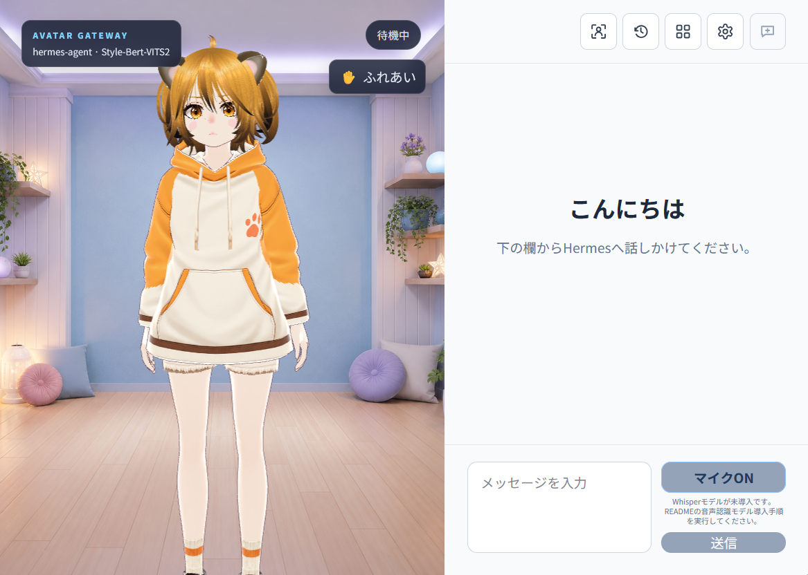

[English](README.en.md)

Avatar Gatewayは、HermesAgentの返答をVRMアバターの表情・口パク・音声とともに届けるローカル会話アプリです。初期版は、人間と1体のAIがFirefoxまたはChromium系ブラウザで会話する用途に絞っています。Hermes Agentと周辺サービスを自分で導入・運用できる利用者を対象に、ソースコードで配布します。

> **利用前の注意：** Avatar Gatewayでできることは、使用するLLMの性能とHermes Agentの能力に依存します。Hermes Agent上で実行できないことが、Avatar Gatewayを経由することで実行できるようになるわけではありません。動作確認に使用したローカルモデルは`Gemma4 26B A4B`です。基本的な会話と動作を確認していますが、ツールコールの安定性には少し不安が残ります。

> 初めて使う方へ：最低限必要なことだけを順番に説明した[クイックスタート](QUICKSTART.md)があります。専門用語もその場で説明しているので、まずはこちらから始めてください。

## 現在できること

- Hermesとの会話やタスクを、VRMアバターと一緒に利用
- 生成中の文章を待たずに表示し、実行中の作業状況や承認要求を確認
- Style-Bert-VITS2による日本語の読み上げ（任意）
- faster-whisperによる日本語の音声入力（任意）
- 読み上げだけを止める操作と、Hermesの作業ごと止める操作
- ページ再読み込み後も、実行中の作業へ再接続
- HermesのSkill・Toolsetの確認
- 会話履歴の閲覧、分岐、削除
- Hermesが生成した画像の表示
- VRMの表情、口パク、待機動作、モーション
- カメラ操作、壁紙変更、アバターとのふれあい
- 音声機能を使わないテキストだけの会話

## 会話で使う日時と時間帯


会話を送るたびに、Avatar Gatewayのバックエンドが現在日時と時間帯をHermesAgentへ渡します。テキスト・音声・ふれあいからの会話で共通して働きます。時刻をきっかけに自発的に話しかける機能ではありません。

初期設定は日本時間（`Asia/Tokyo`）です。サーバーOSがUTCでも日本時間を使います。別の地域で利用する場合は、プロジェクト直下の`.env`へ、例えば`AVATAR_GATEWAY_TIMEZONE=Europe/London`と記載し、バックエンドを再起動してください。設定を省略すると日本時間になります。存在しないタイムゾーン名では起動できないため、綴りを確認してください。現在時刻の元になるサーバーの時計も正しく合わせてください。

| 時間帯 | 現地時刻 |
| --- | --- |
| `morning` | 05:00〜11:59 |
| `daytime` | 12:00〜17:59 |
| `evening` | 18:00〜22:59 |
| `night` | 23:00〜04:59 |

同じセッションでは前回の会話日時も伝えるため、時間の経過を踏まえた返答ができます。新しいセッションは初回の会話として扱います。設定を元に戻すには、`.env`の`AVATAR_GATEWAY_TIMEZONE`を削除するか`Asia/Tokyo`に戻して、バックエンドを再起動してください。

## 必要なもの

- Python 3.11以降
- Node.js 20以降
- HermesAgent API Server
- Style-Bert-VITS2（音声を使う場合）
- faster-whisper（音声入力を使う場合。バックエンド依存関係から導入されます）
- 利用権限のあるVRMファイル（同梱サンプルから差し替える場合）

Hermesは次の設定(.env)で起動している前提です。

```env
API_SERVER_ENABLED=true
API_SERVER_HOST=127.0.0.1
API_SERVER_PORT=8642
API_SERVER_MODEL_NAME=hermes-agent
```

`API_SERVER_KEY`は実際の有効な値を設定し、他人に知られないよう管理してください。

## 1. 初期設定

プロジェクトのルートで設定ファイルを作ります。

```bash
cp .env.example .env
```

`.env`を開き、既定Profileの接続情報を次のように設定します。`HERMES_API_KEY`には、Hermesの`API_SERVER_KEY`と同じ値を指定してください。

```env
HERMES_BASE_URL=http://127.0.0.1:8642/v1
HERMES_API_KEY=HermesのAPI_SERVER_KEY
HERMES_IMAGE_CACHE_DIR=~/.hermes/cache/images
AVATAR_GATEWAY_IMAGE_RETENTION_DAYS=90
```

通常は既定Profileのまま利用できます。別のProfileを使う場合は、[別のHermes Profileを使う（任意）](#別のhermes-profileを使う任意)を確認してください。

Hermesの`image_generate`を使う場合は、生成画像キャッシュの場所も確認します。Hermesの標準配置では上記の値をそのまま利用できます。`HERMES_HOME`を変更している場合は、実際の`cache/images`ディレクトリを指定してください。パスを変更した場合はバックエンドを再起動してください。保持期間は既定の90日で、通常は変更する必要はありません。

生成画像を表示するには、Avatar GatewayバックエンドからHermesの画像キャッシュをローカルファイルとして参照できる必要があります。HermesとAvatar Gatewayを別のサーバーで動かす場合は、Hermesの`cache/images`を共有ストレージなどでAvatar Gateway側へマウントし、そのパスを`HERMES_IMAGE_CACHE_DIR`に指定してください。画像キャッシュを共有できない構成では、会話は利用できますが生成画像は表示されません。

### 音声合成（任意）

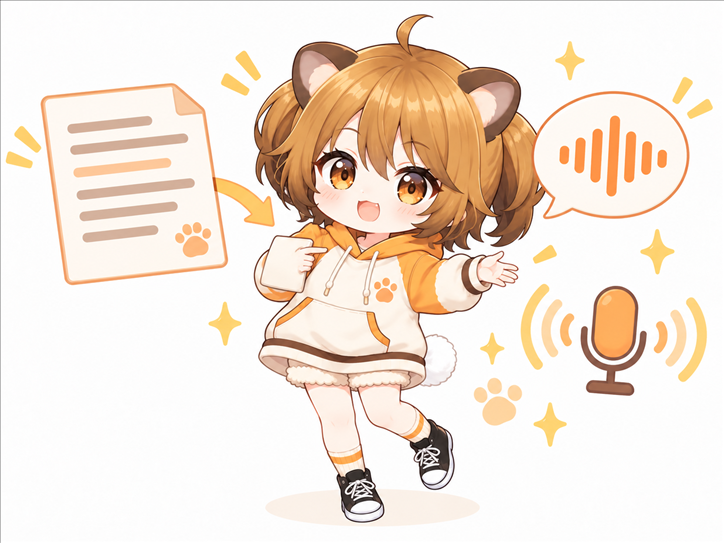

公開用設定例ではStyle-Bert-VITS2を無効にしています。読み上げを使う場合はStyle-Bert-VITS2を起動し、`.env`の`STYLEBERTVITS2_ENABLED=true`へ変更します。接続先や声は次の項目で設定します。

```env
STYLEBERTVITS2_SERVER_URL=http://127.0.0.1:5000
STYLEBERTVITS2_MODEL_ID=0
STYLEBERTVITS2_STYLE=Neutral
STYLEBERTVITS2_SDP_RATIO=0.2
STYLEBERTVITS2_LENGTH=1.0
STYLEBERTVITS2_CHUNK_MIN_CHARS=6
STYLEBERTVITS2_CHUNK_MAX_CHARS=100
```

`CHUNK_MIN_CHARS`は短すぎる文を次の文とまとめる基準、`CHUNK_MAX_CHARS`は句点のない長文を分割する上限です。通常は既定値のままで利用できます。

読み上げを使わずテキストだけで利用する場合は、既定値のままにします。

```env
STYLEBERTVITS2_ENABLED=false
```

### 音声認識（任意）

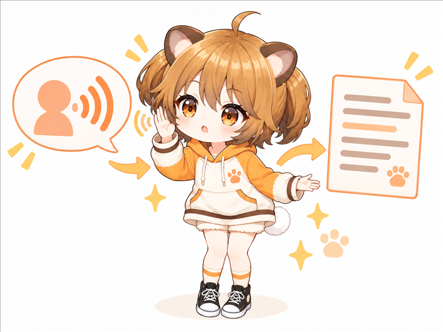

公開用設定例では音声入力も無効にしています。マイク入力を使う場合は`FASTER_WHISPER_ENABLED=true`へ変更します。有効時は、LLMが使用中のVRAMを圧迫しないようCPUのINT8演算を既定にしています。

```env
FASTER_WHISPER_ENABLED=false
FASTER_WHISPER_MODEL=small
FASTER_WHISPER_DEVICE=cpu
FASTER_WHISPER_COMPUTE_TYPE=int8
FASTER_WHISPER_LANGUAGE=ja
FASTER_WHISPER_CPU_THREADS=8
FASTER_WHISPER_BEAM_SIZE=3
FASTER_WHISPER_LOCAL_FILES_ONLY=true
```

音声入力を有効にしても、通常起動中にモデルを自動取得しません。依存関係をインストールした後、後述の明示コマンドで`small`モデルを`local-assets/whisper/`へ取得してください。モデルがない場合はマイクだけを無効化し、テキスト会話と読み上げは継続します。認識速度や精度を比較する場合は、導入前に`FASTER_WHISPER_MODEL`で別のモデルを明示できます。

音声入力を使わない環境では`FASTER_WHISPER_ENABLED=false`にします。この場合もテキスト入力と読み上げは従来どおり利用できます。

## 2. VRMを変更する（任意）

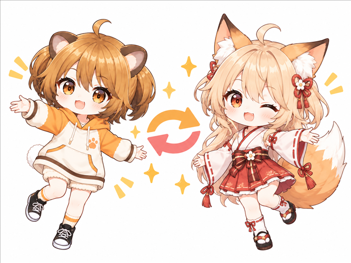

Avatar Gatewayには「はむ子」という名称のサンプルVRMが設定済みです。そのまま使う場合、この作業は必要ありません。「はむ子」は同梱モデルを識別する名称であり、特定の人格や設定は付属しません。利用者が任意の名称や人格を設定して利用できます。

同梱されているVRMファイルは、次の場所にあります。

```text
assets/vrm/はむ子.vrm
```

同梱VRMの利用条件は[はむ子VRMモデル利用規約](docs/character_model_license.md)を確認してください。

別のVRMへ変更する場合は、使用するVRMファイルを次のフォルダへコピーします。

```text
local-assets/vrm/
```

`local-assets/vrm/`は、利用者が追加するVRMを置くためのフォルダです。

次に、`.env`の`AVATAR_VRM_FILE`へコピーしたファイル名を指定します。

```env
AVATAR_VRM_FILE=your-avatar.vrm
```

設定後、Avatar Gatewayのバックエンドを再起動し、ブラウザを再読み込みしてください。

## 3. フロントエンドの準備

初回だけ、画面表示に必要な部品をインストールしてフロントエンドをビルドします。

```bash
cd frontend
npm ci
npm run build
cd ..
```

ビルド結果は`frontend/dist`へ作成され、バックエンドが同じアドレスから配信します。ソースコードを更新した場合は、バックエンドを再起動する前に`frontend`ディレクトリで`npm run build`をもう一度実行してください。

## 4. バックエンドの起動

```bash
cd backend
python3 -m venv .venv
.venv/bin/pip install -r requirements.txt
.venv/bin/python -m app
```

音声入力を使う場合だけ、`.env`で`FASTER_WHISPER_ENABLED=true`へ変更した後、バックエンドを起動する前に次を実行します。

```bash
.venv/bin/python -m scripts.download_whisper_model
```

`download_whisper_model`は、設定済みのWhisperモデル名、保存先、インターネット接続が必要であることを表示してから取得します。通常のAvatar Gateway起動や初回マイク操作が、モデルをバックグラウンド取得することはありません。

疎通確認は別の端末から行えます。

```bash
curl http://127.0.0.1:8000/api/health
```

FirefoxまたはChromium系ブラウザで次を開きます。

```text
http://127.0.0.1:8000
```

最初の音声再生は、ブラウザの自動再生制限を解除するため、必ず画面の送信操作を起点に行われます。それでもFirefoxが音声を止める場合は、アドレスバー付近の自動再生権限を「音声を許可」にしてください。

### 会話画面と標準画面を切り替える

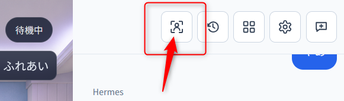


画面上部の人型アイコン（「会話画面へ切り替える」）を押すと、アバターをブラウザ全体へ表示する会話モードに切り替わります。会話モードでは最新の質問と応答だけを、アバターを隠さない映画字幕風の縁取り文字で表示し、セッション履歴や詳細な作業履歴は省略します。マイク、読み上げ停止、作業中断、現在の作業状態、エラー、承認要求は引き続き利用できます。文章を送る場合は「文字入力」を押して入力欄を開いてください。文字入力では`Enter`で改行し、`Ctrl+Enter`（macOSでは`⌘+Enter`）で送信できます。

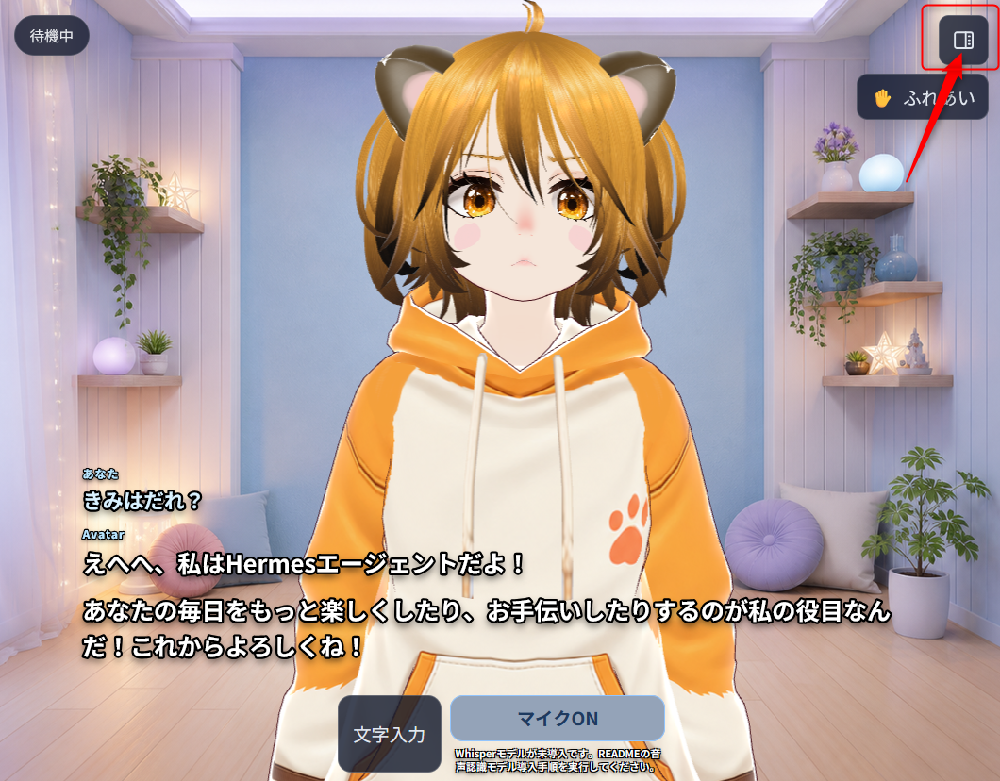

過去のメッセージ、セッション履歴、機能一覧、設定を確認するときは、右上の分割画面アイコン（「標準画面へ切り替える」）を押します。画面を切り替えても現在のセッション、実行中の会話、マイクのON/OFFは維持されます。

標準画面上部の操作は、左から画面切替、セッション履歴、機能一覧、設定、新しいセッションです。マウスポインターを重ねると操作名を確認でき、スクリーンリーダーにも同じ日本語名を通知します。


初めて開くブラウザでは、幅1024px以下の縦画面だけ会話モードから開始します。一度切り替えると選択がそのブラウザへ保存されるため、端末を回転しただけではモードは変わりません。ノッチやホームインジケーターのある端末では、安全領域を避けて操作ボタンを配置します。

会話中は左上に「考えています」「ツールを実行しています」「結果を確認しています」「返答をまとめています」など、Hermesから実際に届いた処理段階を表示します。ツールを呼び出した場合だけ、直近3件のツール名、実行中・完了・失敗、Hermesが提供した所要時間を表示し、次の質問まで残します。ツールを使わなかったという判定や、内部推論本文、ツール引数、実行結果本文は表示しません。

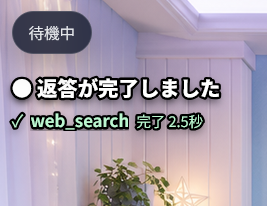

### マイクで話しかける

<mark>音声認識（任意）が設定されていない場合は先にセットアップしてください。</mark>

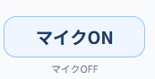

会話欄の「マイクON」を押し、ブラウザのマイク利用確認を許可します。「聞き取り待機中」になったら、そのまま話しかけてください。発話後に既定で0.8秒の無音が続くと録音を確定し、Linux上のfaster-whisperで文字起こししてHermesへ送信します。認識した文章は通常の利用者メッセージとして会話履歴に表示されます。

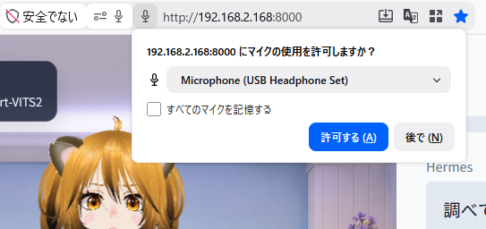

マイクは次の発話に備えて待機を続けます。停止するときは「マイクOFF」を押してください。ページを閉じた場合もマイクと録音処理を終了します。

アバターの発話中やHermesの作業中に話し始めると、現在の作業と読み上げを止め、新しい発話を優先します。スピーカー音を利用者の声として誤検知する場合は、設定画面の「発話検知の感度」の数値を上げるか、ヘッドホンを利用してください。

設定画面の「音声」では、次をブラウザごとに調整できます。

- 話し終わりと判断する無音時間（0.6～2.0秒）
- 発話検知の感度。周囲の音へ反応するときは数値を上げ、声を拾わないときは下げます

WindowsのブラウザからLAN内のLinuxサーバーへHTTP接続する場合、ブラウザの安全機能によってマイクを利用できないことがあります。可能であればHTTPSを使用してください。Avatar Gatewayは音声を外部サービスへ送信せず、同一オリジンのLinuxバックエンドだけへ送ります。

#### LAN内のHTTP接続でマイクを使う

次の設定は、信頼できる家庭内LANでのみ使用してください。例のアドレスは、実際にAvatar Gatewayを開いているアドレスへ置き換えます。

ChromeまたはChromium系ブラウザでは、次の手順で接続先を許可します。

1. アドレスバーへ`chrome://flags/#unsafely-treat-insecure-origin-as-secure`と入力します。
2. `Insecure origins treated as secure`を`Enabled`へ変更します。
3. 入力欄へ、Avatar Gatewayのアドレスをポート番号まで含めて入力します。

   ```text
   http://192.168.1.20:8000
   ```

   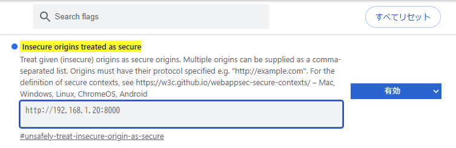

4. ブラウザを再起動します。
5. Avatar Gatewayを開き直し、マイクの利用を許可します。

Firefoxでは、次の手順でHTTP接続からのマイク利用を許可します。

1. アドレスバーへ`about:config`と入力します。
2. 警告を確認して、詳細設定画面を開きます。
3. 次の2項目を検索し、どちらも`true`へ変更します。

   ```text
   media.devices.insecure.enabled
   media.getusermedia.insecure.enabled
   ```

   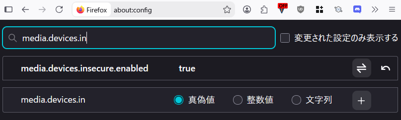

   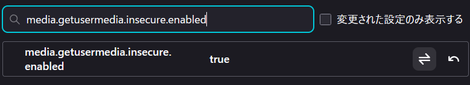

4. Firefoxを再起動します。
5. Avatar Gatewayを開き直し、マイクの利用を許可します。

これらの設定はブラウザの安全制限を緩めます。不要になったら、ChromeまたはChromium系ブラウザの設定を`Default`へ戻し、Firefoxの2項目を`false`へ戻してください。

### UI設定を変更する

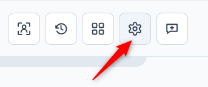

チャット欄上部の歯車アイコン（「設定」）を押すと、次の表示・再生設定を変更できます。

- 動作確認用のモーションボタンを表示するか
- アバター上のカメラ操作案内を表示するか
- ふれあい機能と、反応する部位・モデル別の当たり判定調整
- 読み上げ音量
- カメラの位置、注視点、ズーム相当の距離
- VRM背景の壁紙と表示方法

通常利用ではモーションボタンを隠し、必要なときだけ設定から表示できます。カメラはアバターをマウスまたはタッチで調整した後、「現在位置を保存」を押すとその位置を記憶します。「自動調整へ戻す」ではモデル読込時の全身表示へ戻します。

画面で変更した値は現在のブラウザへ保存され、ページを再読み込みしても維持されます。「ブラウザ設定を初期化」を押すと、このブラウザだけ初期値へ戻ります。

調整結果を新しいブラウザでも使う初期値にしたい場合は、「現在値をサーバー初期値へ保存」を押してください。ほかのブラウザにすでに保存されている設定は変わりません。APIキーやVRMのパスなどは、この画面では変更できません。

#### キャラクターとのふれあい

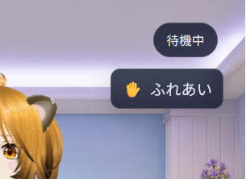


アバター画面の「ふれあい」を押すと、カメラ操作からふれあいモードへ切り替わります。ボタンを固定したくない場合は、文章入力欄の外でSpaceキーを押している間だけ一時的に有効にできます。

##### 反応部位

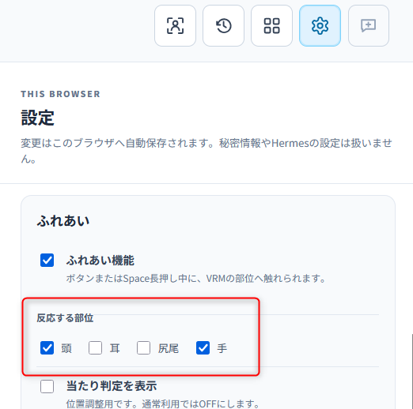

初期設定では頭と手に反応します。設定で耳や尻尾も有効にできます。対象部位をクリックまたはタップすると触れた反応をし、続けて触れた場合は回数をまとめてHermesへ伝えます。対象部位をドラッグすると撫でる操作になり、部位が少し追従して、離すと元へ戻ります。

設定画面の「反動だけテスト」は、動作確認用に残しているデバッグ機能です。通常はOFFのまま使用してください。

Hermesが応答中、ツール実行中、承認待ち、音声処理中の場合は、新しい接触を送信しません。通常の入力欄に書きかけの文章があっても、ふれあいで消去されません。

反応させたくない部位は設定画面から個別に無効化できます。耳と尻尾は初期状態ではOFFです。

#### 当たり判定の調整

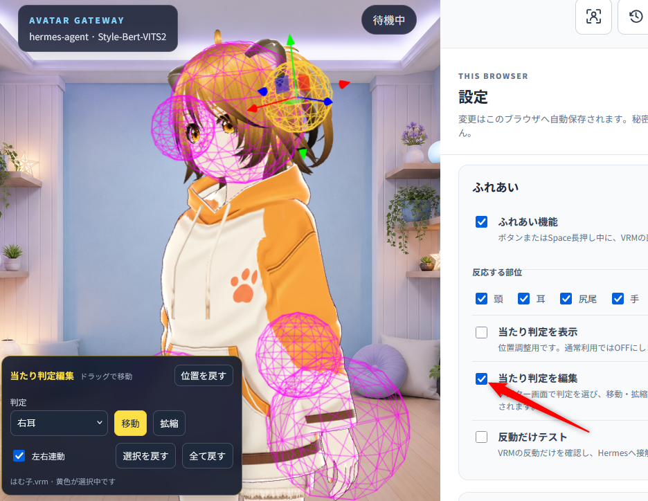

モデルと反応する範囲が合わない場合は、「当たり判定を表示」と「当たり判定を編集」を使って調整できます。通常利用時はどちらもOFFのままにしてください。

VRMを差し替えて判定が合わない場合は、設定画面で「当たり判定を編集」をONにします。アバター画面でワイヤーフレームを直接クリックするか、編集ウインドウの「判定」一覧から部位を選びます。黄色になった判定へ表示されるギズモをドラッグし、「移動」と「拡縮」を切り替えて調整してください。編集ウインドウは見出しをドラッグして邪魔にならない場所へ移動でき、その位置はブラウザへ保存されます。見失った場合は「位置を戻す」を押してください。編集モード中はふれあい入力をHermesへ送信しません。

耳と手は左右を別々に選択できます。「左右連動」がONの場合は、片側の移動を左右反転して反対側へ適用し、寸法も揃えます。尻尾は1個の球を移動・拡縮し、長い尻尾では必要な方向へ伸ばしてください。左右で体格や衣装が異なるモデルでは左右連動をOFFにして個別調整してください。「選択を戻す」は選択中の部位だけを、「全て戻す」は現在のVRMに対する全調整を初期値へ戻します。

調整値はギズモを離した時点で、VRMファイル名ごとのブラウザ設定として自動保存されます。同じファイル名のVRMを再度読み込むと再適用され、別名のVRMには影響しません。ほかのブラウザでも使う場合は、設定画面下部の「現在値をサーバー初期値へ保存」を押して`config/ui.json`へ保存してください。

#### 壁紙を追加する

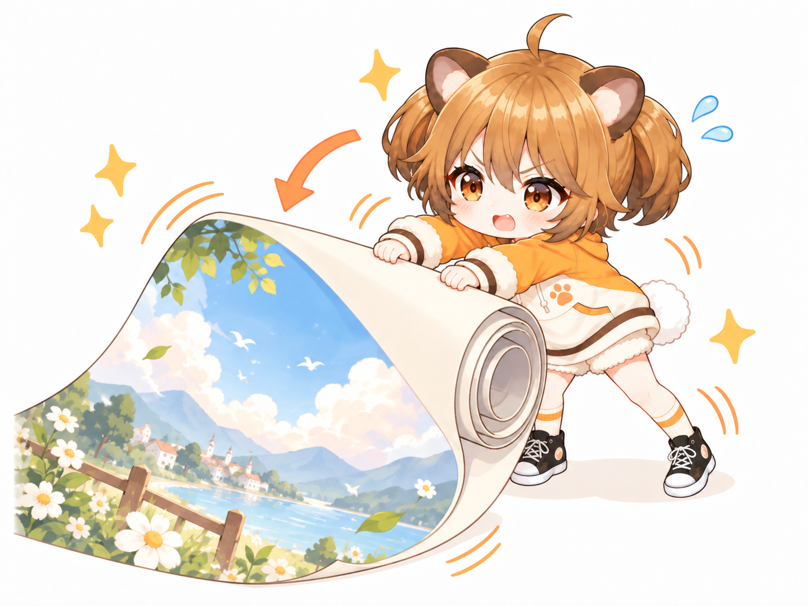

Avatar Gatewayには、中央へVRMを配置しやすい正方形の壁紙を同梱しています。設定画面から選ぶだけで利用でき、clone後の生成やコピーは不要です。

- `cozy-streaming-room.png`: 明るいパステル調の部屋
- `japanese-tatami-room.png`: 障子と庭が見える和室
- `cyber-neon-room.png`: 青紫の照明を使った近未来室
- `classic-library-room.png`: 暖色照明と本棚のクラシック書斎
- `fantasy-sky-room.png`: 空と雲が見える幻想的な空間

同梱壁紙は、同梱VRMAと同じくCC0で提供します。詳しくは[同梱アセットのライセンス](ASSET_LICENSES.md)を確認してください。
- `green-screen.png`: 加工に使える純色`#00ff00`のグリーンバック

利用者固有のPNG、JPEG、WebP画像を追加するときは、プロジェクト内の次の場所へコピーします。

```text
local-assets/backgrounds/
```

バックエンドを再起動する必要はありません。設定画面の「画像一覧を再読込」を押し、「壁紙」の画像欄からファイル名を選択してください。「画面全体を覆う」は余白を作らず表示し、「画像全体を収める」は画像を切らずに表示します。「壁紙なし」を選ぶと標準の暗いグラデーションへ戻ります。

同梱壁紙と同名のローカル画像を置いた場合は、製品ファイルを変更せずローカル版へ差し替えられます。独自画像を別の環境でも使う場合は、同名の画像をその環境にも配置してください。ブラウザから画像ファイルをアップロードする機能はありません。

### 新しいセッションを始める

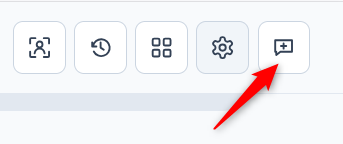

チャット欄上部の吹き出しに`＋`が付いたアイコン（「新しいセッション」）を押すと、確認後に現在のHermesセッションを終了扱いにし、空の会話画面へ切り替えます。セッションとメッセージは削除されず、Hermes側に履歴として残ります。次にメッセージを送ったとき、新しいHermesセッションが自動作成されます。

Hermesが作業中、承認待ち、音声合成中、または発話中は、安全に終了できる状態になるまでボタンを押せません。終了APIへの接続に失敗した場合は画面をクリアせず、現在の会話を維持したままエラーを表示します。

### 保存済みの会話を閲覧する

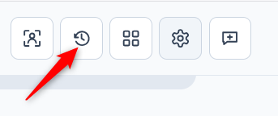

チャット欄上部の時計を囲む矢印アイコン（「セッション履歴」）を押すと、Avatar Gatewayが作成したHermesセッションだけを最終更新順で表示します。現在のセッション、継続中・終了済みの状態、更新日時、メッセージ数、ツール実行数を確認し、一覧から選んだ会話の正式履歴を閲覧できます。最初に50件を取得し、それ以前の履歴は「さらに読み込む」で追加します。

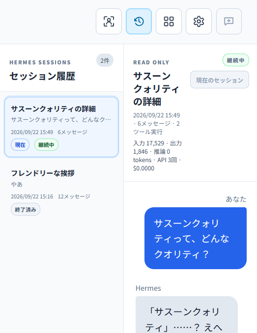

一覧から項目を選ぶだけでは現在の送信先セッションは変わらず、入力欄も表示しません。「会話に戻る」を押すと、開く前の現在の会話へ戻ります。

未終了の項目では「このセッションを開く」を押すと、最新の状態と正式履歴を再確認してから現在の会話として再開できます。元のセッションは終了されず、現在開いていた別のセッションも後から再開できます。入力途中の文章がある場合は、破棄確認を行ってから切り替えます。

終了済みの項目では「この会話の続きから開始」を押すと、確認後に元の履歴を引き継いだ新しい子セッションを作成します。元の終了済みセッションと履歴は変更・削除せず、親子関係もHermesへ保存します。名前変更はこの画面では行いません。

詳細欄ではメッセージ数、ツール実行数、入出力・推論トークン、API呼び出し回数、実額または見積コスト、分岐元を確認できます。Hermesが記録していない統計は`0`または「コスト不明」と表示します。

終了済みで、現在開いていない項目には「この履歴を削除」が表示されます。削除は取り消せず、Hermes SessionDBから会話履歴を完全に消します。分岐済みの子セッションは削除しませんが、Hermesの仕様により親への参照が外れる場合があります。画面の確認に加えてバックエンドも終了状態を再確認し、継続中セッションの削除を拒否します。

### HermesのSkill・Toolsetを確認する

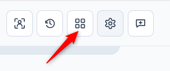

チャット欄上部の四分割アイコン（「機能一覧」）を押すと、Hermes API Serverが現在エージェントへ公開している情報を確認できます。

- 有効なToolsetと、それぞれが展開する具体的なツール名
- 設定済み・無効または未設定のToolset
- 利用可能なSkillの名前、分類、説明

この画面は読み取り専用です。Avatar GatewayからHermesのToolsetやSkill設定は変更しません。表示内容を変更するときはHermes側を設定し、「再読込」を押してください。

### 読み上げ

Style-Bert-VITS2を有効にすると、返答全体の完成を待たず、できあがった文章から順に読み上げます。コマンドや詳しい実行結果は画面だけに表示し、結果の概要を読み上げます。一部の音声生成に失敗しても、文章の表示とその後の読み上げは続きます。

文章を読み上げる単位は、初期設定の`STYLEBERTVITS2_CHUNK_MIN_CHARS`と`STYLEBERTVITS2_CHUNK_MAX_CHARS`で調整できます。通常は変更する必要はありません。

### 生成画像の表示と90日保持

Hermesが画像を生成すると、Avatar Gatewayは画像を`runtime/images/`へ保存し、回答と一緒に表示します。

会話画面では生成画像を回答テキストから分離し、全体を確認しやすい専用カードへ表示します。画像を選ぶと原寸を別タブで開き、右上の`×`でカードだけを閉じられます。標準画面では従来どおり回答内へ表示します。

保存期間は初期設定で90日です。Avatar GatewayはHermes側の元画像を変更・削除しません。

残したい画像は、表示されている間にブラウザから保存してください。削除後に古い履歴を開いた場合、文章は残りますが画像は表示できません。

### 読み上げと作業を途中で止める

Hermesの生成中、音声の準備中、または発話中は、「読み上げ停止」と赤い「作業を中断」の2つのボタンを表示します。

「読み上げ停止」は、現在の返答の音声だけを止めます。Hermesの作業、ツール、承認、文章生成と画面表示は続きます。次のメッセージでは読み上げが自動的に有効へ戻ります。

「作業を中断」は、Hermesの現在の作業と読み上げをまとめて停止し、入力欄を再び使える状態にします。

どちらの操作でも、停止までに届いた文章は会話欄へ残ります。

### 実行中の作業への再接続

Hermesが作業中、ツール実行中、または承認待ちの間にページを再読み込みしても、同じAvatar Gatewayバックエンドが動き続けていれば実行中の作業へ自動的に再接続します。

再読み込み前に生成された音声は自動再生しません。古い発話を突然読み直さないため、再接続後はテキストと作業状態だけを復元します。

Avatar Gatewayバックエンド自体を再起動した場合は、実行途中の細かな表示や承認ボタンを復元できないことがあります。保存済みの会話履歴は、Hermesから再取得して表示します。内容を確認できない承認操作は復元せず、「作業を中断」だけを利用できます。

### 作業状況と承認

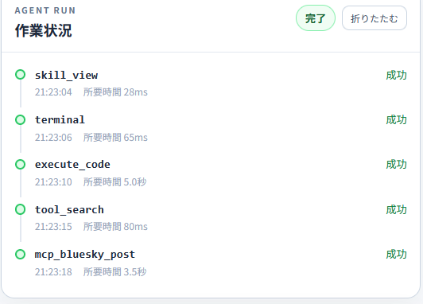

Hermesがツールを使うと、会話欄の下に作業状況が表示されます。ツール名、開始時刻、実行中・成功・失敗、Hermesが提供した所要時間を実行順に確認できます。会話、作業状況、承認は同じ領域を上下にスクロールし、入力欄だけが画面下部に残ります。作業状況は「折りたたむ」で見出しだけにできます。ツール結果本文やファイル差分がHermesから提供されない場合、Avatar Gatewayは内容を推測して表示しません。

危険な操作でHermesが停止すると、黄色い承認パネルに説明と秘匿情報除去済みのコマンドが表示されます。選択肢の意味は次のとおりです。

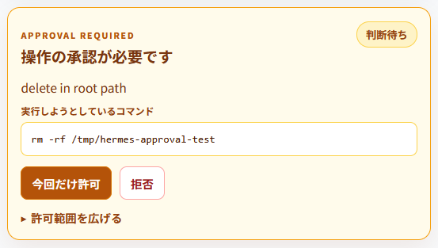

- 「今回だけ許可」: 現在の要求だけを許可します。通常はこちらを選びます。
- 「拒否」: 現在の要求を実行させません。
- 「このセッション中は許可」: 同じセッション内の同種操作で、確認を省略する範囲を広げます。
- 「今後も許可」: Run終了後にも影響する可能性があります。画面内の再確認後にだけ送信できます。

回答送信中はボタンが無効になります。承認が別の操作で解決された場合や期限切れの場合は、パネルにその旨を表示します。

### VRMAの動作確認

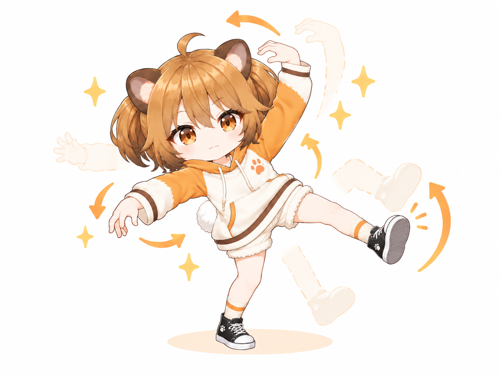

標準モーションは完成済みVRMAとして`assets/motions/`へ同梱しています。ダウンロード後に変換や生成を行う必要はありません。

同梱VRMAはCC0で提供します。クレジット表記は不要で、利用・改変・再配布・商用利用を制限しません。詳しくは[同梱アセットのライセンス](ASSET_LICENSES.md)を確認してください。

設定画面で「モーション確認ボタン」を表示すると、登録済みモーションを再生できます。「停止」を押すと待機姿勢へ戻ります。

登録前のVRMAを試すときは、標準画面のアバター領域へ`.vrma`ファイルをドラッグ＆ドロップするか、「VRMAを試す」から選択します。ファイルはブラウザ内だけで一時再生され、サーバーへは送信されません。ページを再読み込みすると選択状態は消えます。

会話中は、Hermesの返答に合わせて登録済みのモーションと表情が自動的に切り替わります。

### モーションカタログの編集

モーションの登録先は`config/motions.json`です。初期設定には、静止VRMA 15件と、動的なうなずきが入っています。

```json
{
  "schema_version": 1,
  "generating_motion": "hands_behind_back",
  "motions": [
    {
      "name": "hands_behind_back",
      "label": "手を後ろで組む",
      "file": "手を後ろで組むポーズ.vrma",
      "prompt": "穏やかに考える、落ち着いて待つ返答",
      "playback": "auto",
      "exit_duration_seconds": 0.6,
      "enabled": true
    }
  ]
}
```

各項目には次の意味があります。

- `name`: モーションの識別名です。英小文字で始め、英小文字・数字・`_`・`-`を使用します。`none`は予約済みです。
- `label`: 画面の動作確認ボタンと再生状態に表示する名前です。
- `file`: `assets/motions/`または`local-assets/motions/`へ置いたVRMAのファイル名です。ディレクトリは指定できません。
- `prompt`: Hermesがどのような返答で選ぶべきか判断するための短い説明です。
- `playback`: 省略時は`auto`です。`pose`はVRMAの先頭フレームを停止まで保持し、`animation`はファイルの再生時間どおりに一回再生します。`auto`は長さ0秒または全トラックが1キーのVRMAだけを静止ポーズとして扱います。
- `exit_duration_seconds`: 待機姿勢へ戻る秒数です。省略時は`0.6`秒で、`0.1`から`5.0`まで指定できます。前屈みなど移動量が大きいポーズでは`1.0`から`1.5`程度へ延ばすと自然になります。
- `enabled`: `false`にすると、設定を残したままHermesの選択肢と画面のボタンから外せます。
- `generating_motion`: Hermesの文章生成中に使うモーション名です。不要なら`null`にできます。

製品同梱モーションを追加する手順は次のとおりです。

1. 利用・再配布できることを確認済みの完成VRMAを`assets/motions/`へ置きます。
2. `config/motions.json`の`motions`配列へ設定を追加します。
3. FastAPIを再起動または自動リロードし、ブラウザを更新します。
4. アバター下部に追加した確認ボタンが表示されることを確認します。
5. 会話で該当する内容を返させ、発話中に自動選択されることを確認します。

利用者が独自のVRMAを試す場合は`local-assets/motions/`へ配置できます。同名ファイルが`assets/motions/`にある場合も、ローカル版を優先するため、製品同梱版を変更せずに差し替えを確認できます。新しいファイル名で追加する場合は、製品同梱時と同様に`config/motions.json`へも登録してください。

設定に誤りがある場合は画面に理由を表示し、モーション連動だけを停止してテキスト会話と音声は継続します。設定済みVRMAが見つからない場合もファイル名を画面に表示し、その項目をHermesの選択肢から自動的に外します。

静止ポーズとして作ったVRMAが一度再生しただけで戻ってしまう場合は、その項目へ`"playback": "pose"`を指定してください。

### カメラ操作

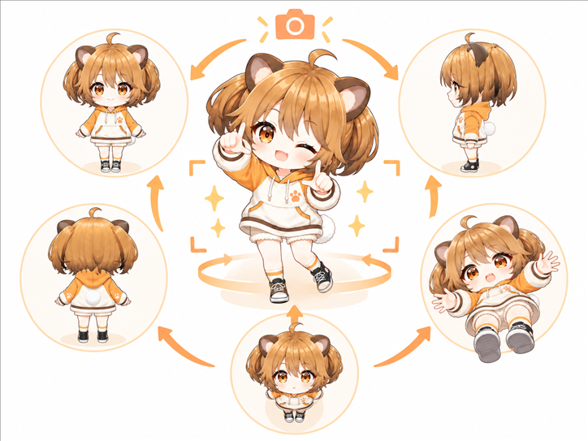

VRMを読み込むと、全身が収まる位置へカメラを自動調整します。次の操作を利用できます。

```text
左ドラッグ: 上下左右へ移動
マウスホイール／中ドラッグ: ズーム
右ドラッグ: カメラを回転
タッチ: 1本指で回転、2本指でズーム・移動
```

「カメラをリセット」を押すと、モデル読み込み時の自動調整位置へ戻ります。

## 5. 開発用フロントエンドを起動する（任意）

画面を開発しながら変更を即時反映したい場合だけ、バックエンドとは別にVite開発サーバーを起動します。通常利用では必要ありません。

```bash
cd frontend
npm run dev
```

この場合は`http://127.0.0.1:5173`を開きます。バックエンドもポート8000で起動しておいてください。

## 6. LAN内の別端末から利用する

LAN公開では、開発用Viteサーバーを使わず、通常手順でビルドしたフロントエンドをFastAPIから同一オリジン配信します。.envへ次のように設定してください。

```env
AVATAR_GATEWAY_HOST=0.0.0.0
AVATAR_GATEWAY_PORT=8000
AVATAR_GATEWAY_LAN_MODE=true
AVATAR_GATEWAY_AUTH_USERNAME=avatar
AVATAR_GATEWAY_AUTH_PASSWORD=
AVATAR_GATEWAY_ALLOWED_HOSTS=192.168.1.20,avatar-gateway.local
```

`AVATAR_GATEWAY_ALLOWED_HOSTS`にはクライアント端末ではなく、ブラウザのアドレス欄でAvatar Gatewayへ接続するときに使うサーバーのIPアドレスまたはホスト名を指定します。複数ある場合はカンマで区切ります。`*`は使用できません。

```bash
cd frontend
npm run build
cd ../backend
.venv/bin/python -m app
```

別端末で`http://192.168.1.20:8000`のように開きます。家庭内LANなど認証が不要な環境では、`AVATAR_GATEWAY_AUTH_PASSWORD`を空のまま利用できます。

Basic認証を使う場合だけ、`AVATAR_GATEWAY_AUTH_PASSWORD`へ16文字以上の値を設定してください。ブラウザの認証画面が表示され、静的画面、API、音声、ローカル資産が同じ認証で保護されます。パスワード設定時は更新系APIも同一オリジンからの操作だけを受け付けます。

HTTP Basic認証はアクセス制限を提供しますが、HTTP通信自体を暗号化しません。信頼できる家庭内LANだけで使用してください。共有ネットワークやインターネット越しに公開する場合は、HTTPS対応のリバースプロキシまたはVPNを必須とし、Avatar Gatewayを直接公開しないでください。

## 別のHermes Profileを使う（任意）

Hermes Profileは、ペルソナ、記憶、会話履歴、モデル、SkillなどをProfileごとに分けて管理する仕組みです。既定Profileだけを使う場合、この設定は不要です。

Avatar GatewayにはProfileの切替画面がないため、プロジェクト直下の`.env`を編集して切り替えます。`AVATAR_VRM_FILE`で選んだ外見と、`STYLEBERTVITS2_*`で設定した声はAvatar Gateway側の設定なので変わりません。

作業中の会話を中断しないよう、Hermesの作業と読み上げが終わってから切り替えてください。最初に、利用できるProfile名を確認します。

```bash
hermes profile list
```

例えば`ivy`という名前付きProfileを、Hermesの共有Gatewayから使う場合は次のようにします。

```env
HERMES_BASE_URL=http://127.0.0.1:8642/p/ivy/v1
HERMES_API_KEY=ivyのAPI_SERVER_KEY
HERMES_IMAGE_CACHE_DIR=~/.hermes/profiles/ivy/cache/images
```

`HERMES_BASE_URL`には末尾の`/v1`まで含め、Profile名は`hermes profile list`に表示された名前をそのまま使用します。Profileごとに`API_SERVER_KEY`が異なる場合は、`HERMES_API_KEY`も切替先に合わせてください。生成画像を正しく表示するため、`HERMES_IMAGE_CACHE_DIR`も一緒に変更します。

Hermesを標準の`~/.hermes`以外へ配置している場合は、`HERMES_IMAGE_CACHE_DIR`の先頭を実際の`HERMES_HOME`へ置き換えます。例えば`HERMES_HOME=/srv/hermes`なら、`ivy`の画像ディレクトリは`/srv/hermes/profiles/ivy/cache/images`です。

名前付きProfileの`/p/<Profile名>/v1`を使うには、Hermesの既定Gatewayで`gateway.multiplex_profiles: true`が有効になり、そのProfileが共有Gatewayから提供されている必要があります。Hermes側でこの設定やProfileを変更した場合は、Hermes Gatewayも再起動してください。

`.env`を保存したらAvatar Gatewayバックエンドを再起動し、ブラウザを再読み込みします。その後「新しいセッション」を選び、切替先Profileで会話を始めます。会話履歴はProfileごとに分かれています。

接続状態は次のURLで確認できます。

```bash
curl http://127.0.0.1:8000/api/health
```

画面に「HermesがCapabilities APIに対応していません」と表示される場合は、次を確認してください。

- `HERMES_BASE_URL`が`/p/<Profile名>/v1`まで含んでいるか
- Profile名の大文字・小文字と綴りが`hermes profile list`の表示に一致しているか
- Hermesの既定Gatewayが起動し、`gateway.multiplex_profiles`が有効か
- 切替先Profileが共有Gatewayの提供対象に含まれているか
- `HERMES_API_KEY`が切替先Profileの`API_SERVER_KEY`と一致しているか

既定Profileへ戻すときは、[初期設定](#1-初期設定)に記載した値へ戻し、Avatar Gatewayバックエンドを再起動してください。

## GPUで音声認識を実行する（任意）

音声認識は既定ではCPUを使います。NVIDIA GPUでfaster-whisperを実行する場合は、先に[faster-whisper公式のGPU要件](https://github.com/SYSTRAN/faster-whisper#gpu)に従って、対応するCUDA 12用cuBLASとcuDNN 9を用意してください。

`.env`の音声認識設定を次のように変更します。

```env
FASTER_WHISPER_DEVICE=cuda
FASTER_WHISPER_COMPUTE_TYPE=float16
```

VRAM使用量を抑えたい場合は、`FASTER_WHISPER_COMPUTE_TYPE=int8_float16`も選べます。HermesのLLMなどを同じGPUで動かしている場合は、合計のVRAM使用量に注意してください。競合する場合は`cpu`と`int8`へ戻せます。

設定後にバックエンドを再起動し、マイク入力を一度実行します。`CT2_VERBOSE=1`を付けてバックエンドを起動すると、モデル読込時のログで`device cuda:0`と実際の計算形式を確認できます。

### 音声認識モデルを変更する（任意）

既定の`small`以外を使う場合は、`.env`のモデル名を変更します。日本語では`.en`が付かない多言語モデルを選んでください。

| モデル | 特徴 |
| --- | --- |
| `tiny` | 最も軽量で高速ですが、認識精度は低めです。 |
| `base` | 軽さを優先しつつ、`tiny`より精度を上げたい場合に向きます。 |
| `small` | 既定値です。速度、精度、必要資源のバランスを取っています。 |
| `medium` | `small`より高い精度を求める場合に向きますが、処理時間と必要資源が増えます。 |
| `large-v3` | 高い精度を優先するモデルで、必要なVRAMと処理時間が大きくなります。 |
| `turbo` | large系の精度を保ちながら速度を重視したモデルです。 |

たとえば`medium`へ変更する場合は、次のように指定します。

```env
FASTER_WHISPER_MODEL=medium
```

バックエンドを停止してから、同じ導入コマンドを再実行します。ダウンロード中は進捗が表示されます。

```bash
cd backend
.venv/bin/python -m scripts.download_whisper_model
```

取得が完了したらバックエンドを起動します。モデルは既定の保存先へ取得されるため、保存先の設定を増やす必要はありません。別のモデルへ戻す場合も`FASTER_WHISPER_MODEL`を変更し、同じ導入コマンドを再実行してください。

## よくある問題

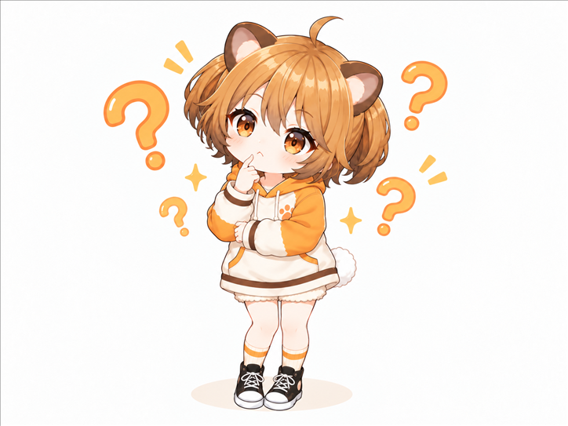

### Hermesへ接続できない

- HermesのAPI Serverが`127.0.0.1:8642`で起動しているか確認します。
- `.env`の`HERMES_API_KEY`がHermesの`API_SERVER_KEY`と一致しているか確認します。
- `HERMES_BASE_URL`には末尾の`/v1`まで含めます。

### 機能一覧で`Skill一覧APIエラー: 502`と表示される

現状のHermesでは、`GET /v1/skills`が内部エラーになる組み合わせがあります。この場合、Avatar Gatewayの「機能一覧」は読み込めませんが、通常の会話やタスク実行には影響しません。Avatar Gateway側の接続設定を変更しても解消しません。

Hermes側で修正する場合は、`gateway/platforms/api_server.py`の`APIServerAdapter._handle_skills`を確認してください。ここから呼び出す`tools.skills_tool._find_all_skills`の定義は`skip_disabled`だけを受け取るため、未対応の`include_editorial`を渡さないようにします。

```python
skills = _sort_skills(
    _find_all_skills(skip_disabled=False)
)
```

修正後はHermes Gatewayを再起動し、`GET /v1/skills`が成功することを確認してから、Avatar Gatewayの「機能一覧」で「再読込」を押してください。これはHermes側の暫定修正であり、正式な修正が取り込まれた場合は上流の実装を優先してください。

### 音声だけ生成できない

- Style-Bert-VITS2が`127.0.0.1:5000`で起動しているか確認します。
- ブラウザに表示されるエラー本文には、Style-Bert-VITS2のHTTPステータスと応答概要が含まれます。
- 一時的に`STYLEBERTVITS2_ENABLED=false`へ変更すれば、テキスト会話とVRM表示を先に確認できます。
- 音声が細かく分かれすぎる場合は`STYLEBERTVITS2_CHUNK_MIN_CHARS`を増やします。
- 一文が長く合成開始が遅い場合は`STYLEBERTVITS2_CHUNK_MAX_CHARS`を小さくします。小さくしすぎると発音のつながりが不自然になるため、まず80〜120程度で調整してください。

### VRMが表示されない

- 同梱の`assets/vrm/`または差し替え用の`local-assets/vrm/`に、`AVATAR_VRM_FILE`と同名のファイルがあるか確認します。
- `/api/health`の`vrm_available`が`true`か確認します。
- 拡張子だけを変更したファイルではなく、VRM 0.x/1.0形式のモデルか確認します。
- サイズの大きいモデルは初回読み込みに時間がかかることがあります。

### マイクをONにできない

- バックエンドの依存関係を導入した後、`backend`ディレクトリで`.venv/bin/python -m scripts.download_whisper_model`を実行します。
- `.env`の`FASTER_WHISPER_LOCAL_FILES_ONLY=true`は変更せず、通常起動中の外部取得を禁止します。
- LAN内の別端末からHTTPで開いている場合は、ブラウザの安全機能によってマイクが拒否されることがあります。[LAN内のHTTP接続でマイクを使う](#lan内のhttp接続でマイクを使う)を参照してください。Firefoxでは`media.devices.insecure.enabled`と`media.getusermedia.insecure.enabled`の両方が`true`か確認し、設定後にブラウザを再起動します。
- 音声入力を使わない場合は`FASTER_WHISPER_ENABLED=false`にします。

## セキュリティ

- HermesとStyle-Bert-VITS2の認証情報はバックエンドだけが読みます。
- 初期設定では`127.0.0.1`だけで待ち受け、LANへ公開しません。
- 製品資産として公開するのは`assets/`の同梱VRM・VRMA・背景画像、利用者固有資産として公開するのはこのプロジェクトの`local-assets/`へ明示的に配置したファイルだけです。
- 生成画像として公開するのは、Hermesの`image_generate`結果から`runtime/images/`へ複製したファイルだけです。
- LANモードは明示的な許可ホストを必須にし、Basic認証は必要な環境だけ任意で有効にできます。
- 対応する設定なしに`AVATAR_GATEWAY_HOST`を外部待受へ変更すると、バックエンドは起動を拒否します。
- LAN上のHTTPは暗号化されないため、信頼できないネットワークではHTTPSまたはVPNを併用します。

## 主なオープンソースソフトウェア

Avatar Gatewayは、次のオープンソースソフトウェアを利用しています。

- [Hermes Agent](https://github.com/NousResearch/hermes-agent): 会話とツール実行を担う外部サービス
- [React](https://github.com/facebook/react)、[three.js](https://github.com/mrdoob/three.js)、[@pixiv/three-vrm](https://github.com/pixiv/three-vrm): 画面とVRMアバターの表示
- [FastAPI](https://github.com/fastapi/fastapi): バックエンドAPI
- [faster-whisper](https://github.com/SYSTRAN/faster-whisper): 任意で利用する音声認識
- [Style-Bert-VITS2](https://github.com/litagin02/Style-Bert-VITS2): 任意で連携する音声合成サービス

各ソフトウェアには、それぞれのライセンスが適用されます。区分とライセンスの概要は[第三者ソフトウェアに関する表記](THIRD_PARTY_NOTICES.md)を確認してください。

## ライセンス

- Avatar Gateway本体のソースコード: [MIT License](LICENSE)
- 同梱VRMA・背景画像: [CC0 1.0](ASSET_LICENSES.md)
- `はむ子.vrm`: [VRMモデル専用利用規約](docs/character_model_license.md)

利用者が`local-assets/`へ追加したモデル・モーション・画像には、それぞれの制作者が定める利用条件が適用されます。

## 初期版の範囲外

複数キャラクターの同時表示は初期版の対象外です。
